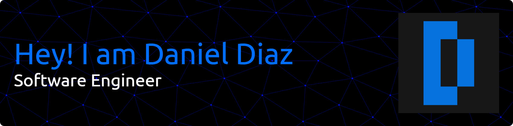

  

## 👩🏻‍💻 About Me
- 👋 Hi, I'm @ddi4z.  
- 💻 I'm a final-year Systems & Computer Engineering student at Uniandes.  
- 🌎 I’ll be joining Microsoft as a Software Engineering Intern during the first semester of 2026.  
- 🛠️ I’m currently maintaining **Mi Horario Uniandes**, an open-source project under **Open Source Uniandes** that helps students efficiently plan their university schedules.  
- 📚 I'm passionate about software engineering, data structures, and algorithm design.  
- 💞️ I’m always eager to collaborate on open-source projects that make an impact.  
- 💪 I enjoy competitive programming, I’ve participated in the **ICPC** at both national and regional levels.

<h2><strong>🚀 Skills</strong></h2>

     

<h2><strong>📫 Contact Me</strong></h2>

   &nbsp;&nbsp;

   &nbsp;&nbsp;

   &nbsp;&nbsp;

