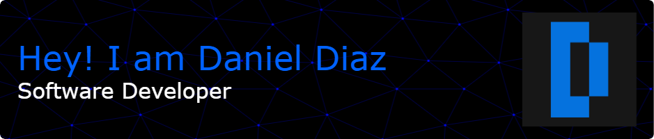

  

## 👩🏻‍💻 About Me
- 👋 Hi, I'm @ddi4z.
- 🔭 I’m currently working on [Open Source Uniandes](https://github.com/Open-Source-Uniandes)
- 👀 I'm passionate about learning everything related to software development and algorithm design.
- 🌱 Currently, I'm diving into web development and sharpening my skills in Data Structures and Algorithms (DSA).
- 💞️ I'm eager to collaborate on open-source projects.

<h2><strong>🚀 Skills</strong></h2>

     

<h2><strong>📫 Contact Me</strong></h2>

   &nbsp;&nbsp;

   &nbsp;&nbsp;

   &nbsp;&nbsp;

